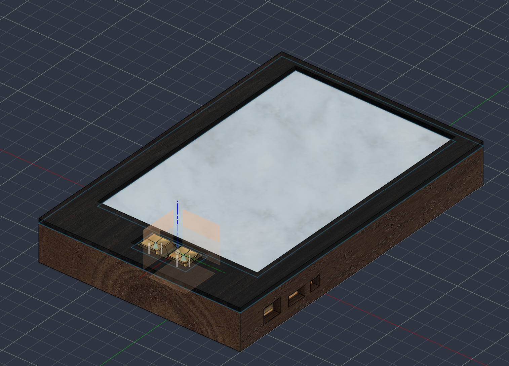
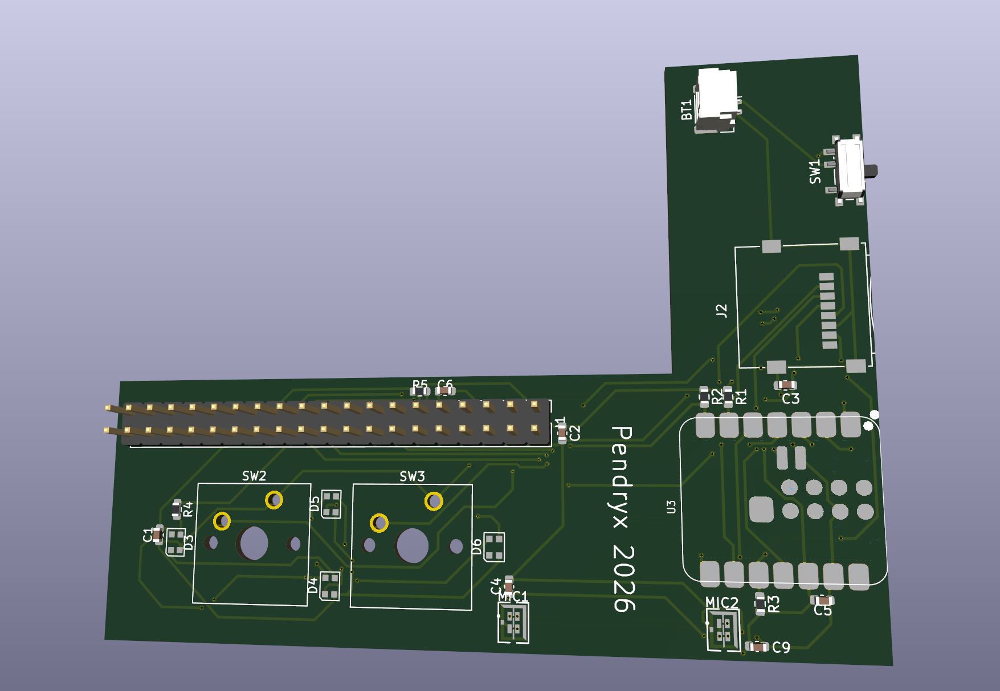
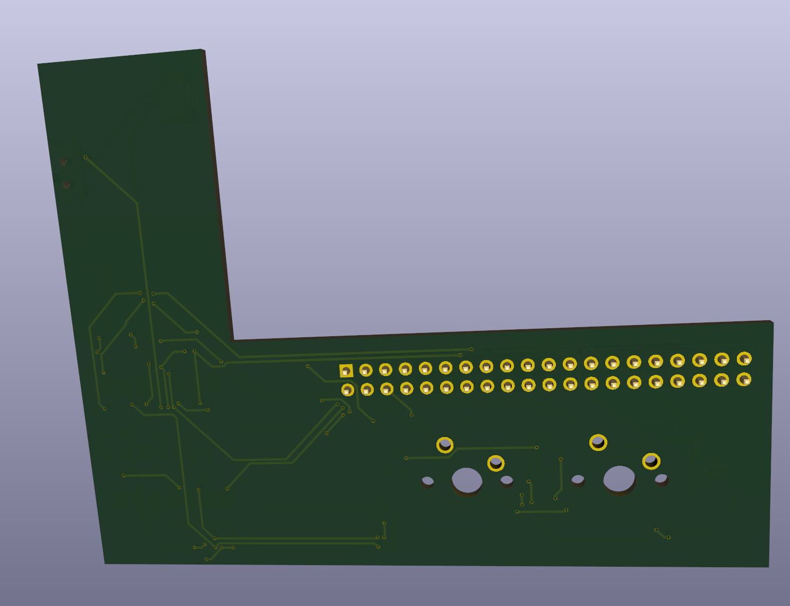
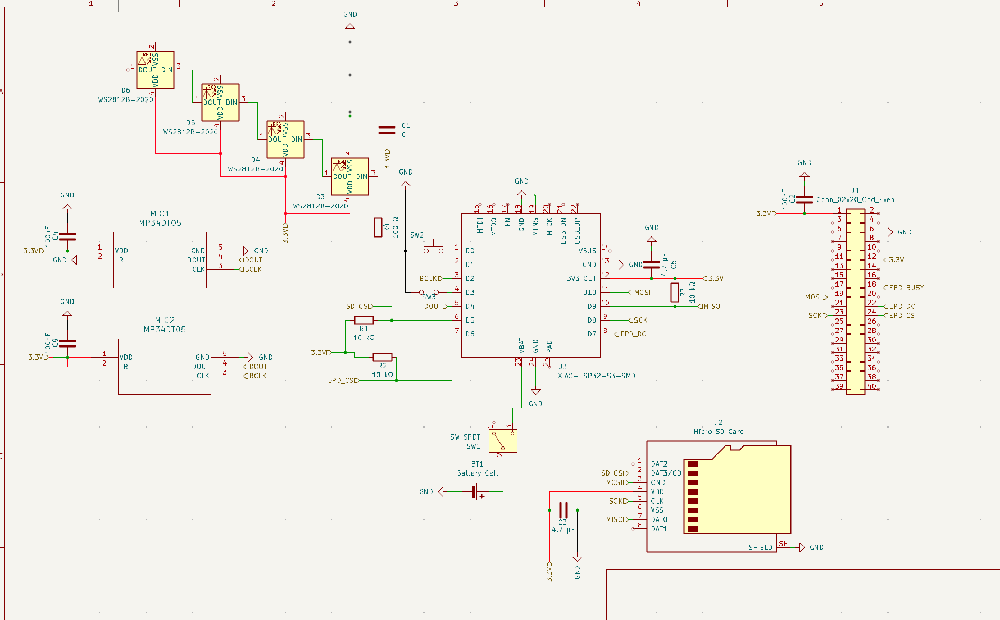

# The Tome Of Boundless Knowledge
A voice recognition E-paper spell tome and reference book for things such as dnd.
 The Tome will listen for a wake word followed by a category of spell, at which point it lists all spells in that category. When one is spoken, it will display it.
 I wanted to make this as an easier way to manage spells and other data for these scenerios, and plan to expand it's database past spells in the future and provide alternate firmware for purposes such as just using it as an e-reader.
Here is the full CAD model:

Front and back of the PCB:

And here is the schematic for the design:

Cost Breakdown: 
$35 for items in digikey BOM plus shipping, tariffs, and tax  
$16 for PCB with PCB, stencil, shipping, and tax  
$100 for e-paper display, extra cable, battery, and micro-sd card
$30 for enclosure and assembly costs (filament, more solder, and outer case materials 
Amazon list: <a href="https://www.amazon.com/hz/wishlist/ls/1FPKA3BWPPRNU?ref_=wl_share" target="_blank">HERE</a>  
Total: $181
